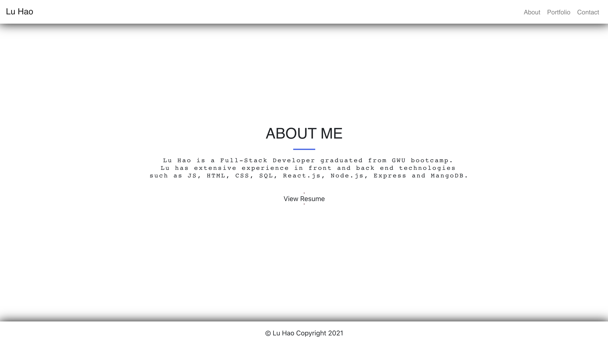

# react_portfolio

This application was built using React and component state and router.  The application has three pages, the first page and also the landing page is About Me page, where has my simple introduction. The second page is Portfolio page, where I listed some of my projects with a screenshot of the each project and link directly to the GitHub repo. The last page is Contact page, and I listed three social media platforms I use frequently and feel free to reach out to me. 

## Table of Contents
* [Screenshots](#Screenshots)
* [Installation](#Installation)
* [Usage](#Usage)
* [Technologies](#Technologies)
* [Repository](#Repository)
* [Deployment](#Deployment)

#### About page
The following is a screenshot of the About Me page of the portfolio application.

  

#### Portfolio page
The following is a screenshot of the Portfolio page of the portfolio application.

  

#### Contact page
The following is a screenshot of the Contact page of three social media platforms that you can find me.

  

## Installation

* Fork or clone the repo.
* Make sure to install all the dependencies by running the following command:
    * **npm install**

## Usage

To use this application once installed, the user launches the application from a terminal window as follows:

**npm start**

This will then open a browser window at localhost:3000.

The application can alternatively be run as a deployed application following the link in the Deployment section.

## Technologies

* React
* BroswerRouter
* axios
* Bootstrap
* HTML
* CSS

## Repository

Direct link to repository:  https://github.com/lhaodev/react_portfolio

## Deployment

The React Portfolio application is deployed on Heroku: https://tranquil-fjord-53321.herokuapp.com/

